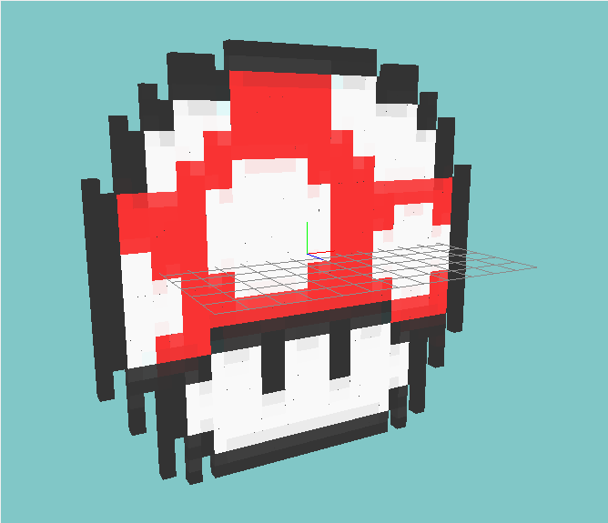

NVX
---
NVX is an image _"voxalizer"_.

Getting Started
---------------
I do not provide any `binaries` for `NVX` at this point in time, and
therefore you'll have to compile it yourself.

```bash
premake4 gmake
cd build
make config=release
```

To run it, you would type:

```bash
nvx -f nvx.tga -o nvx.obj
```

Voila!



*WARNING: It will only work with 32 bit uncompressed TGA images.*

To find out more type ```nvx -h```.

Contribute
----------
* Fork the project.
* Make your feature addition or bug fix.
* Do **not** bump the version number.
* Send me a pull request. Bonus points for topic branches.

License
-------
Copyright (c) 2014, Mihail Szabolcs

NVX is provided **as-is** under the **MIT** license. 
For more information see LICENSE.
